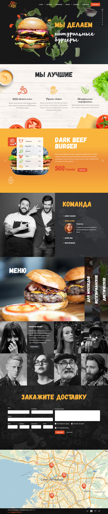

# Лендинг для магазина бургеров. 
Выпускной проект курса  "Веб-разработка для начинающих" в школе онлайн-образования Loftschool

https://zarinamambetova.github.io/landing-burgers/

В проекте использованы: 
- Технология One Page Scroll
- Отправка данных средствами AJAX
- SVG, adaptive, animation 
- Верстка блочных элементов с использованием технологии FLEXBOX

Интерактивные элементы сайта написаны на JAVASCRIPT при помощи библиотеки JQUERY